# hay checker

A data quality tool.
Haychecker provides both a script to be called by submitting it to spark-submit
or to be run with the python3 interpreter, and a library.
The script can be found in the root directory, named hay_checker.py, the library
can be installed with pip either online or by running setup tools and creating
a package installable with pip locally (the setup.py file can be found in the root directory).
By submitting the script to spark-submit, spark will be used to import the data and perform computations, while
by using the python interpreter spark will be used to import the data, and pandas to perform computations.

The library has 2 main packages, chc and dhc, which respectively stand for centralized hay checker
and distributed hay checker, they are basically two "symmetric" libraries themselves, with the same
exact API. Those libraries are based on a single Task class, which is a container for metrics
that will/can be computed later or on different dataframes, and a number of functions (metrics) which
will either compute and return results when called or return a Task, to be later run or expanded by adding
more metrics/tasks to it.

The point of the Task class is to 1) allow defining things once, but to use those defined metrics
multiple times, 2) trying to optimize/combine metrics that can be run together in a single call, instead of calling
them one at a time, when possible.

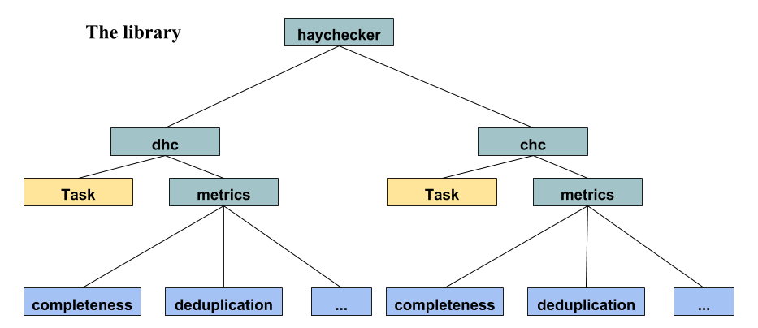

## Getting Started

These instructions will provide a simple guide on how to use the tool and 
the prerequisites needed for both distributed and centralized versions of
 *hay checker*

### Prerequisites

What things you need to use *haychecker* (both script and library)

(requirements needed from the distributed side)

```
hadoop
spark
pyspark
```

(requirements needed from the centralized side)

```
pandas
```

## API Reference & examples

### Script usage

The script [*hay_checker.py*](hay_checker.py) can be used by calling

```bash
spark-submit your-spark-parameters hay_checker.py --config <path to config.json>
```
or
```bash
python3 hay_checker.py --config <path to config.json>
```

to use the *distributed* or *centralized* versions, respectively. 
The distributed version will use spark for data importing and computation, the centralized  version
will use spark for data importing and pandas for computation.

**Input**

A .json configuration file, where the following values can be provided:

|             |                                                                                                                                                                                                                                                 |
|-------------|-------------------------------------------------------------------------------------------------------------------------------------------------------------------------------------------------------------------------------------------------|
| table       | a string with information about the input table location, it can be:     - html link to local or remote file     - jdbc file path     - hdfs file path (by default a path that is not html link or jdbc file is assumed to be a hdfs file path) |
| inferSchema | boolean, spark inferSchema argument for csv import, setting this to true will also allow casting of columns which are strings when confronted with values having a numeric type, if false such casting is not performed, and instead an error is raised                                                                                                                                                                                              |
| delimiter   | string, spark delimiter argument for csv import                                                                                                                                                                                                 |
| header      | boolean, spark inferSchema argument for csv import                                                                                                                                                                                              |
| output      | a string with path to output file                                                                                                                                                                                                               |
| verbose     | boolean, if true configuration options are printed to the screen, *optional*, default=false                                                                                                                                                                                |
| metrics     | a list of *metric* objects, composed by the following fields:      - "metric": a string specifying the name of the metric     - metric arguments, in key:value format                                                                           |


[config-example.json](examples/resources/config-example.json) in the *examples/resources* directory is provided as an example.

**Output**

A .json file containing scores of input metrics

### Python library

Simple examples of metrics usage. More examples and source code can be 
found in [examples](./examples) folder

**Centralized version**

Import a dataframe
```python
import pandas as pd

df = pd.read_csv("examples/resources/employees.csv")

pd.set_option('max_columns', 10)
print(df)
```
Output
```text
    lastName firstName                  title   birthDate    hireDate  \
0    Davolio     Nancy   Sales Representative  1948/12/08  1992/05/01   
1     Fuller    Andrew  Vice President, Sales  1952/02/19  1992/08/14   
2  Leverling     Janet   Sales Representative  1963/08/30  1992/04/01   
3    Peacock  Margaret   Sales Representative  1937/09/19  1993/05/03   
4   Buchanan    Steven          Sales Manager  1955/03/04  1993/10/17   
5     Suyama   Michael   Sales Representative  1963/07/02  1993/10/17   
6       King    Robert   Sales Representative  1960/05/29  1994/01/02   

       city region  reportsTo  salary  
0   Seattle     WA        2.0    2000  
1    Tacoma     WA        NaN    3000  
2  Kirkland     WA        2.0    2000  
3   Redmond     WA        2.0    2000  
4    London    NaN        2.0    2500  
5    London    NaN        5.0    2000  
6    London    NaN        5.0    2000 
```

**Distributed version**

Create a spark session
```python
from pyspark.sql import SparkSession

spark = SparkSession.builder.appName("Deduplication_approximated_example").getOrCreate()
```

Import a dataframe

```python
df = spark.read.format("csv").option("header", "true").load("examples/resources/employees.csv")
df.show()
```
Output
```text
+---------+---------+--------------------+----------+----------+--------+------+---------+------+
| lastName|firstName|               title| birthDate|  hireDate|    city|region|reportsTo|salary|
+---------+---------+--------------------+----------+----------+--------+------+---------+------+
|  Davolio|    Nancy|Sales Representative|1948/12/08|1992/05/01| Seattle|    WA|        2|  2000|
|   Fuller|   Andrew|Vice President, S...|1952/02/19|1992/08/14|  Tacoma|    WA|     null|  3000|
|Leverling|    Janet|Sales Representative|1963/08/30|1992/04/01|Kirkland|    WA|        2|  2000|
|  Peacock| Margaret|Sales Representative|1937/09/19|1993/05/03| Redmond|    WA|        2|  2000|
| Buchanan|   Steven|       Sales Manager|1955/03/04|1993/10/17|  London|  null|        2|  2500|
|   Suyama|  Michael|Sales Representative|1963/07/02|1993/10/17|  London|  null|        5|  2000|
|     King|   Robert|Sales Representative|1960/05/29|1994/01/02|  London|  null|        5|  2000|
+---------+---------+--------------------+----------+----------+--------+------+---------+------+

```

In the following examples all imports are of the form *from haychecker.**dhc**.metrics import \<metric\>*
For the centralized version all metric calls are identical, while import has the form 
*from haychecker.**chc**.metrics import \<metric\>*

### Completeness
Measures how complete is the dataset by counting which entities are not 
missing (Nan or Null/None) in a column or in the whole table.


- column:

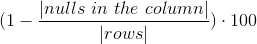
   
- table: 

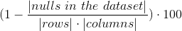

***method* metrics.completeness(columns=None, df=None)**

Arguments

|         |                                                                                                                                |
|---------|--------------------------------------------------------------------------------------------------------------------------------|
| columns | Columns on which to run the metric, None to run the completeness metric on the whole table.                                     |
| df      | Dataframe on which to run the metric, None to have this function return a Task instance containing this metric to be run later. |

Example

```python
from haychecker.dhc.metrics import completeness
r1, r2 = completeness(["region", "reportsTo"], df)
print("Completeness region: {}, completeness reportsTo: {}".format(r1, r2))
```
Output
```text
Completeness region: 57.14285714285714, completeness reportsTo: 85.71428571428571
```

---
### Deduplication
Measures how many values are duplicated within a column/dataset, NaN and Null values
are considered duplicated.

- column:

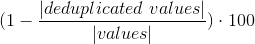
       
- table: 

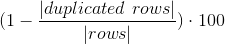


***method* metrics.deduplication(columns=None, df=None)**

Arguments

|         |                                                                                                                                |
|---------|--------------------------------------------------------------------------------------------------------------------------------|
| columns | Columns on which to run the metric, None to run the deduplication metric on the whole table.                                    |
| df      | Dataframe on which to run the metric, None to have this function return a Task instance containing this metric to be run later  |

Example

```python
from haychecker.dhc.metrics import deduplication
r1, r2 = deduplication(["title", "city"], df)
print("Deduplication title: {}, deduplication city: {}".format(r1, r2))
```
Output
```text
Deduplication title: 42.857142857142854, deduplication city: 71.42857142857143
```

---
### Deduplication_approximated
Deduplication metric implementation using approximated count of distinct values,
  faster then the standard deduplication implementation.

***method* metrics.deduplication_approximated(columns=None, df=None)**

Arguments

|         |                                                                                                                               |
|---------|-------------------------------------------------------------------------------------------------------------------------------|
| columns | Columns on which to run the metric, differently from deduplication, this cannot be run "on the whole table", checking deduplication at a row level, but only on 1 column at a time, meaning that the columns parameter cannot be None, and must always contain at least one column.                       |
| df      | Dataframe on which to run the metric, None to have this function return a Task instance containingthis metric to be run later |

Example

```python
from haychecker.dhc.metrics import deduplication_approximated
r1, r2 = deduplication_approximated(["title", "city"], df)
print("Deduplication_approximated title: {}, deduplication_approximated city: {}".format(r1, r2))
```
Output
```text
Deduplication_approximated title: 42.857142857142854, deduplication_approximated city: 71.42857142857143
```
---
### Timeliness
Reflects how up-to-date the dataset is with respect to the given date/time.

- column

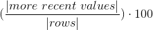

!
In the centralized version of the library the [strftime](http://strftime.org/) directives
are used to express the date/time format arguments, while in the distributed version the [simple date format](https://docs.oracle.com/javase/7/docs/api/java/text/SimpleDateFormat.html) directives are used.

***method* metrics.timeliness(columns, value, df=None, dateFormat=None, timeFormat=None)**

Arguments

|            |                                                                                                                                                                                                                                         |
|------------|-----------------------------------------------------------------------------------------------------------------------------------------------------------------------------------------------------------------------------------------|
| columns    | Columns on which to run the metric, columns of type string will be casted to timestamp using the dateFormat or timeFormat argument                                                                                                                                                                                                   |
| value      | Value used to run the metric, confronting values in the specified columns against it                                                                                                                                                    |
| dateFormat | Format in which the value (and values in columns, if they are of string type) are; used to cast columns if they contain dates as strings. Either dateFormat or timeFormat must be passed, but not both|
| timeFormat | Format in which the value (and values in columns, if they are of string type) are; used to cast columns if they contain dates as strings. Either dateFormat or timeFormat must be passed, but not both|
| df         | Dataframe on which to run the metric, None to have this function return a Task instance containing this metric to be run later                                                                                                           |


If a dateFormat is passed, only days are considered for the comparison, hours, minutes, seconds, etc. are ignored.

If a timeFormat is passed, if the timeFormat contains tokens that represent years, months, days, or anything
related to dates, the comparison is made considering "everything". On the contrary, the comparison
will only consider hours, minutes and seconds, allowing for a comparison between a value which is just
a time, like 23:54:10 and timestamps which contain also years, months, etc; if we want to only
compare by times while also having years/months/days in our timestamp. 

Example

```python
from haychecker.dhc.metrics import timeliness
r1 = timeliness(["birthDate"], dateFormat="yyyy/MM/dd", df=df, value="1960/10/22")[0]
print("Timeliness birthDate with respect to date 1960/10/22: {}".format(r1))
```
Output
```text
Timeliness birthDate with respect to date 1960/10/22: 71.42857142857143
```
---
### Freshness
Measures how fresh is the dataset by taking the average distance of
 the tuples from the current date/time. Results are returned either in days or seconds, depending
on what format is passed, dateFormat for days and timeFormat for seconds.
    
- column

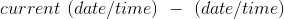

!
In the centralized version of the library the [strftime](http://strftime.org/) directives
are used to express the date/time format arguments, while in the distributed version the [simple date format](https://docs.oracle.com/javase/7/docs/api/java/text/SimpleDateFormat.html) directives are used.


    
***method* metrics.freshness(columns, df=None, dateFormat=None, timeFormat=None)**

Arguments

|            |                                                                                                                                                                                                                                                                    |
|------------|--------------------------------------------------------------------------------------------------------------------------------------------------------------------------------------------------------------------------------------------------------------------|
| columns    | Columns on which to run the metric, columns of type string will be casted to timestamp using the dateFormat or timeFormat argument.                                                                                                                                                                                                                           |
| dateFormat | Format in which the values in columns are if those columns are of type string; otherwise they must be of type date or timestamp. Use this parameter if you are interested in a result in terms of days. Either dateFormat or timeFormat must be passed, but not both. 
| timeFormat | Format in which the values in columns are if those columns are of type string; otherwise they must be of type timestamp. Use this parameter if you are interested in results in terms of seconds. Either dateFormat or timeFormat must be passed, but not both. |
| df         | Dataframe on which to run the metric, None to have this function return a Task instance containing this metric to be run later                                                                                                                                      |


If a dateFormat is passed, the average distance in days is returned, without considering hours, minutes, seconds, etc.

If a timeFormat is passed and it contains tokens that represent years, months, days, or anything
related to dates, the average distance in seconds is returned, also considering years, months and days.
If the timeFormat does not contain anything related to dates, the average distance will be computed
without considering years, months and days. This allows for computing the average distance only considering
the hours, minutes, and seconds in our timestamps, if we are interested in how distant they are from "now" as a
time and not as a date.

Example

```python
from haychecker.dhc.metrics import freshness
r1 = freshness(["birthDate"], dateFormat="yyyy/MM/dd", df=df)[0]
print("Freshness birthDate: {}".format(r1))
```
Output
```text
Freshness birthDate: 23434.571428571428 days
```
---
### Entropy *(of a column)*

Shannon entropy of a column.

- column X

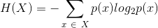

***method* metrics.entropy(column, df=None)**

Arguments

|        |                                                                                                                               |
|--------|-------------------------------------------------------------------------------------------------------------------------------|
| column | Columns on which to run the metric                                                                                            |
| df     | Dataframe on which to run the metric, None to have this function return a Task instance containin gthis metric to be run later |

Null and NaN are ignored for computing results.

Example

```python
from haychecker.dhc.metrics import entropy
r1 = entropy("firstName", df)[0]
print("Entropy firstName: {}".format(r1))
```
Output
```text
Entropy firstName: 2.807354922057604
```
---
### Mutual information *(between two columns)*

- two columns X and Y

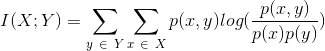

***method* metrics.mutual_info(when, then, df=None)**

Arguments

|      |                                                                                                                               |
|------|-------------------------------------------------------------------------------------------------------------------------------|
| when | First column on which to compute MI                                                                                           |
| then | Second column on which to compute MI                                                                                          |
| df   | Dataframe on which to run the metric, None to have this function return a Task instance containin gthis metric to be run later |

Null and NaN are ignored for computing results (pairs containing Nans or Nulls are discarded).

Example

```python
from haychecker.dhc.metrics import mutual_info
r1 = mutual_info("title", "salary", df)[0]
print("Mutual information title/salary: {}".format(r1))
```
Output
```text
Mutual information title/salary: 0.7963116401738128
```
---
### Constraint

After filtering data on conditions, measures how many tuples satisfy/break a given functional dependency,
a functional dependency is a dependency where values of one
 set of columns imply values of another set of columns.
 
- table

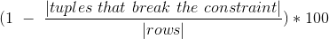

***method* metrics.constraint(when, then, conditions=None, df=None)**

Arguments

|            |                                                                                                                               |
|------------|-------------------------------------------------------------------------------------------------------------------------------|
| when       | A list of columns in the df to use as the precondition of a functional constraint. No column should be in both when and then   |
| then       | A list of columns in the df to use as the postcondition of a functional constraint. No column should be in both when and then  |
| conditions | Conditions on which to filter data before applying the metric                                                                 |
| df         | Dataframe on which to run the metric, None to have this function return a Task instance containing this metric to be run later |

If any condition would lead to a comparison between a column of string type and a number, if casting
is allowed (allow_casting in the Task class constructor, or inferSchema in the config.json file), there will be
an attempt to cast the column to a numeric type.


Conditions are expressed as dictionaries, are defined on one column at a time, and allow for 
the following operators: "gt", "lt" and "eq"; value should be a string or a number.
Conditions in the list we pass as an argument are intended to be joined by AND.
```python
condition1 = {"column": "salary", "operator": "gt", "value": 2100}
```

Example

```python
from haychecker.dhc.metrics import constraint
r1 = constraint(["title"], ["salary"], df=df)[0]
print("Constraint title/salary: {}".format(r1))
```
Output
```text
Constraint title/salary: 100.0
```
---
### Rule check

Measures how many values satisfy a rule

- table

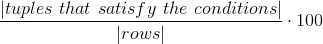

***method* metrics.rule(conditions, df=None)**

Arguments

|            |                                                                                                                                |
|------------|--------------------------------------------------------------------------------------------------------------------------------|
| conditions | Conditions on which to run the metric                                                                                          |
| df         | Dataframe on which to run the metric, None to have this function return a Task instance containing this metric to be run later |

If any condition would lead to a comparison between a column of string type and a number, if casting
is allowed (allow_casting in the Task class constructor, or inferSchema in the config.json file), there will be
an attempt to cast the column to a numeric type.

Conditions are expressed as dictionaries, are defined on one column at a time, and allow for 
the following operators: "gt", "lt" and "eq"; value should be a string or a number.
Conditions in the list we pass as an argument are intended to be joined by AND.
```python
condition1 = {"column": "salary", "operator": "gt", "value": 2100}
```


Example

```python
from haychecker.dhc.metrics import rule
condition1 = {"column": "salary", "operator": "gt", "value": 2100}
conditions = [condition1]
r1 = rule(conditions, df)[0]
print("Rule salary>2100: {}".format(r1))
```
Output
```text
Rule salary>2100: 28.57142857142857
```
---
### Grouprule check

Measures how many values satisfy a rule by
filtering data on conditions, and then checking the percentage of groups passing the
having conditions, which are conditions on aggregations on the groups.

- table 

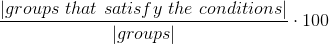

***method* metrics.contains_date(format)**

Arguments

|            |                                                                                                                                |
|------------|--------------------------------------------------------------------------------------------------------------------------------|
| columns    | Columns on which to run the metric, grouping data                                                                              |
| conditions | Conditions on which to run the metric, filtering data before grouping, can be None                                             |
| having     | Conditions to apply to groups                                                                                                  |
| df         | Dataframe on which to run the metric, None to have this function return a Task instance containing this metric to be run later |

If any condition would lead to a comparison between a column of string type and a number, if casting
is allowed (allow_casting in the Task class constructor, or inferSchema in the config.json file), there will be
an attempt to cast the column to a numeric type.

Conditions are expressed as dictionaries, are defined on one column at a time, and allow for 
the following operators: "gt", "lt" and "eq"; value should be a string or a number.
Conditions in the list we pass as an argument are intended to be joined by AND.
```python
condition1 = {"column": "salary", "operator": "gt", "value": 2100}
```

Havings are conditions expressed on aggregations of certain columns, as conditions, they are defined as 
dictionaries, specified on one column at a time and intended as joined by an AND operator.
The operators "gt", "lt" and "eq" are allowed, and the aggregators "count", "min", "max", "avg", "sum" 
can be used.
To perform a "count(\*)", simply provide "count" as an aggregator, and "\*" as column.
```python
having1 = {"column": "*", "operator": "gt", "value": 1, "aggregator": "count"}
```


Example
```python
from haychecker.dhc.metrics import grouprule
condition1 = {"column": "city", "operator": "eq", "value": "London"}
conditions = [condition1]
having1 = {"column": "*", "operator": "gt", "value": 1, "aggregator": "count"}
havings = [having1]
r1 = grouprule(["title"], havings, conditions, df)[0]
print("Grouprule groupby \'title\' where city=\'London\' having count * > 1: {}".format(r1))
```
Output
```text
Grouprule groupby 'title' where city='London' having count * > 1: 50.0
```
---

### Task class
The Task class acts as a container for metrics, allowing to store them and add more of them programmatically,
a Task can be either instantiated empty (Task()) or by passing a list of metrics, where each metric is a dict
defining parameters as in the config.json file. 
Tasks can be added to other tasks, (basically appending the metrics contained in one to the other); moreover, a 
metric function called without a dataframe will return a Task containing the metric itself, effectively
allowing to add more metrics to a Task instance in a natural way.
Metrics that can be run in the same call/aggregation/pass on data will be run in such a way, otherwise
they will be run internally one at a time.


***class* task.Task(metrics_params=[], allow_casting=True)**

Arguments

|                |                                                                                                                                                                                                                                                                                                                                     |
|----------------|-------------------------------------------------------------------------------------------------------------------------------------------------------------------------------------------------------------------------------------------------------------------------------------------------------------------------------------|
| metrics_params | List of metrics, each metric is a dictionary mapping params of the metric to a value, as in the json config file                                                                                                                                                                                                                    |
| allow_casting  | If a column not of the type of what it is evaluated against (i.e. a condition checking for column 'x' being gt 3.0, with the type of 'x' being string) should be casted to the type of the value it is checked against. If casting is not allowed the previous example would provoke an error, (through an assertion); default is True |

Example

If in a metric function call a dataframe df is not specified, a *Task* instance with 
input parameters is returned.

```python
from haychecker.dhc.task import Task
from haychecker.dhc.metrics import *

# create an empty Task
task = Task()

# the metric function returns a Task instance because it has not been called with a df
task1 = completeness(["region", "reportsTo"])
task2 = completeness(["city"])

task.add(task1)
task.add(task2)

# we can also add tasks is a more natural and concise way
# the add operator also allows chaining
task.add(deduplication(["title", "city"]))
task.add(deduplication(["lastName"]))


# run all metrics contained in the task 
# the method will return a list of dictionaries which are the metrics 
# contained in the Task instance, where each metric has also a "scores" field added, containing 
# related scores
result = task.run(df)


r1, r2 = result[0]["scores"]
r3 = result[1]["scores"][0]

print("Completeness region: {}, completeness reportsTo: {}, completeness city: {}".format(r1, r2, r3))

r1, r2 = result[2]["scores"]
r3 = result[3]["scores"][0]

print("Deduplication title: {}, deduplication city: {}, deduplication lastName: {}".format(r1, r2, r3))

```  
Output 

```text
Completeness region: 57.14285714285714, completeness reportsTo: 85.71428571428571, completeness city: 100.0
Deduplication title: 42.857142857142854, deduplication city: 71.42857142857143, deduplication lastName: 100.0
```

## Authors

* Jacopo Gobbi
* Kateryna Konotopska

## License

This project is licensed under the MIT License - see the [LICENSE](LICENSE) file for details


